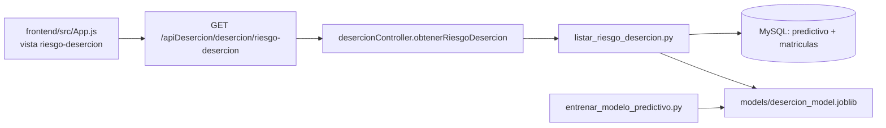

# Modelo predictivo de deserción

Documentación y **copia de referencia** del módulo de machine learning del proyecto DesercionBueno.

> **Importante:** Los archivos que usa la aplicación en ejecución siguen en `backend/` y `frontend/`. La carpeta `predictivo/` es una réplica para consulta, respaldo o documentación. Si editas aquí, copia los cambios a las rutas originales.

## Mapa del flujo



## Estructura de esta carpeta

```
predictivo/
├── MODELO_PREDICTIVO.md          ← Este archivo
├── backend/
│   ├── scripts/
│   │   ├── entrenar_modelo_predictivo.py   # Entrenamiento
│   │   ├── listar_riesgo_desercion.py      # Listado con umbral (UI)
│   │   ├── predecir_desercion.py           # Predicción por payload JSON
│   │   ├── mostrar_metricas_modelo.py      # Ver métricas del entrenamiento
│   │   └── requirements_predictivo.txt     # Dependencias Python
│   ├── models/
│   │   ├── desercion_model.joblib          # Modelo entrenado
│   │   └── desercion_metrics.json          # Métricas (ROC AUC, matriz, etc.)
│   ├── controllers/
│   │   └── desercionController.js          # spawn de scripts Python
│   └── routes/
│       └── desercion.js                    # Rutas /predict y /riesgo-desercion
└── frontend/
    └── src/
        └── App.js                          # Pantalla "Riesgo de deserción (ML)"
```

Rutas equivalentes en el proyecto activo:

| Copia en `predictivo/` | Ubicación en el repo |
|------------------------|----------------------|
| `backend/scripts/*.py` | `backend/scripts/` |
| `backend/models/*` | `backend/models/` |
| `backend/controllers/desercionController.js` | `backend/controllers/` |
| `backend/routes/desercion.js` | `backend/routes/` |
| `frontend/src/App.js` | `frontend/src/App.js` |

## Variables del modelo

**Features (entrada):**

- `MUNIPROCEDENCIA`
- `GENERO`
- `Sisben`
- `PROMEDIO_PONDERADO`
- `promReligion`
- `promMatematica`
- `promCarrera`

**Target (solo entrenamiento):** columna `deserto` en la tabla `predictivo`.

**Algoritmo:** regresión logística (`LogisticRegression`) dentro de un `Pipeline` de scikit-learn (imputación + one-hot en categóricas).

## Requisitos

- **Node.js** (backend y frontend del proyecto principal).
- **Python 3** con pip.
- **MySQL** accesible con la tabla `predictivo` y `matriculas`.
- Archivo **`backend/.env`** en la raíz del backend (no en `predictivo/`), con al menos:

```env
PORT=3020
DB_HOST=ingenieria.unac.edu.co
DB_USER=tu_usuario
DB_PASSWORD=tu_contraseña
DB_NAME=desercionUnac
JWT_SECRET=tu_secreto
# Opcional:
DB_PORT=3306
PREDICTIVO_TABLE=predictivo
PYTHON_BIN=python
```

## Instalar dependencias Python

Desde la raíz del repositorio:

```powershell
cd C:\Users\LEGION\Proyectos\DesercionBueno
python -m pip install -r backend\scripts\requirements_predictivo.txt
```

Contenido de `requirements_predictivo.txt`:

- pandas
- scikit-learn>=1.4
- joblib
- mysql-connector-python
- python-dotenv

## Entrenar el modelo

```powershell
cd C:\Users\LEGION\Proyectos\DesercionBueno
python backend\scripts\entrenar_modelo_predictivo.py
```

Genera:

- `backend/models/desercion_model.joblib`
- `backend/models/desercion_metrics.json`

Ver métricas en consola:

```powershell
python backend\scripts\mostrar_metricas_modelo.py
```

## Scripts de inferencia (línea de comandos)

### Listar estudiantes con alto riesgo

```powershell
python backend\scripts\listar_riesgo_desercion.py --periodo actual --umbral 0.7 --limite 200
```

Parámetros:

| Parámetro | Descripción |
|-----------|-------------|
| `--periodo` | `actual`, `anterior` o un periodo concreto (ej. `2024-1`) |
| `--umbral` | Probabilidad mínima de deserción (0–1), default `0.7` |
| `--limite` | Máximo de registros devueltos, default `200` |
| `--facultad` | Filtro opcional |
| `--programa` | Filtro opcional |

Salida: JSON por stdout con `periodo`, `umbral` y `results`.

### Predecir desde JSON (stdin)

```powershell
echo [{"MUNIPROCEDENCIA":"...","GENERO":"M",...}] | python backend\scripts\predecir_desercion.py
```

## API REST (backend Node)

Definidas en `backend/routes/desercion.js` e implementadas en `desercionController.js`:

| Método | Ruta | Controlador | Script Python |
|--------|------|-------------|---------------|
| `POST` | `/apiDesercion/desercion/predict` | `predecirDesercion` | `predecir_desercion.py` |
| `GET` | `/apiDesercion/desercion/riesgo-desercion` | `obtenerRiesgoDesercion` | `listar_riesgo_desercion.py` |

Ambas requieren **JWT** (`Authorization: Bearer <token>`).

Ejemplo de consulta de riesgo:

```http
GET http://localhost:3020/apiDesercion/desercion/riesgo-desercion?periodo=actual&umbral=0.7&limite=200
Authorization: Bearer <token>
```

El controlador ejecuta:

```text
python backend/scripts/listar_riesgo_desercion.py --periodo ... --umbral ... ...
```

Variable opcional `PYTHON_BIN` si el ejecutable no se llama `python`.

## Frontend

En `frontend/src/App.js`:

- Vista: `riesgo-desercion` (menú **"Riesgo de deserción (ML)"**).
- Función: `fetchRiesgoDesercion` → `GET /apiDesercion/desercion/riesgo-desercion`.
- Estado: `riesgoLista`, `riesgoUmbral`, filtros facultad/programa.
- UI aproximada: líneas ~11528 en adelante (`vista === 'riesgo-desercion'`).

En desarrollo, el frontend apunta por defecto a `http://localhost:3020`.

## Puesta en marcha del proyecto completo

### Backend

```powershell
cd backend
npm install
npm start
```

Puerto por defecto: **3020**.

### Frontend

```powershell
cd frontend
npm install
npm start
```

Abrir **http://localhost:3000**, iniciar sesión y entrar a **Riesgo de deserción (ML)**.

## Solución de problemas

| Error | Causa habitual | Acción |
|-------|----------------|--------|
| `ModuleNotFoundError: No module named 'pandas'` | Dependencias Python no instaladas | `pip install -r backend/scripts/requirements_predictivo.txt` |
| `No se encontró el modelo. Entrena primero.` | Falta `desercion_model.joblib` | Ejecutar `entrenar_modelo_predictivo.py` |
| `Falta variable de entorno: DB_HOST` | Sin `backend/.env` | Crear `.env` desde `.env.example` |
| `Token no proporcionado` (401) | API sin autenticación | Login en la app o enviar Bearer token |
| Error al ejecutar consulta de riesgo | Python/DB/script | Revisar stderr del proceso; probar el script a mano |

## Resumen de responsabilidades por archivo

| Archivo | Rol |
|---------|-----|
| `entrenar_modelo_predictivo.py` | Entrena y guarda el `.joblib` |
| `listar_riesgo_desercion.py` | Consulta BD, predice, filtra por umbral |
| `predecir_desercion.py` | Predicción ad hoc vía JSON |
| `mostrar_metricas_modelo.py` | Imprime métricas del último entrenamiento |
| `desercionController.js` | Puente Node → Python (`spawn`) |
| `desercion.js` | Registro de rutas HTTP |
| `App.js` | Interfaz de usuario del módulo ML |

---

*Última actualización: copia generada desde el repositorio DesercionBueno.*
